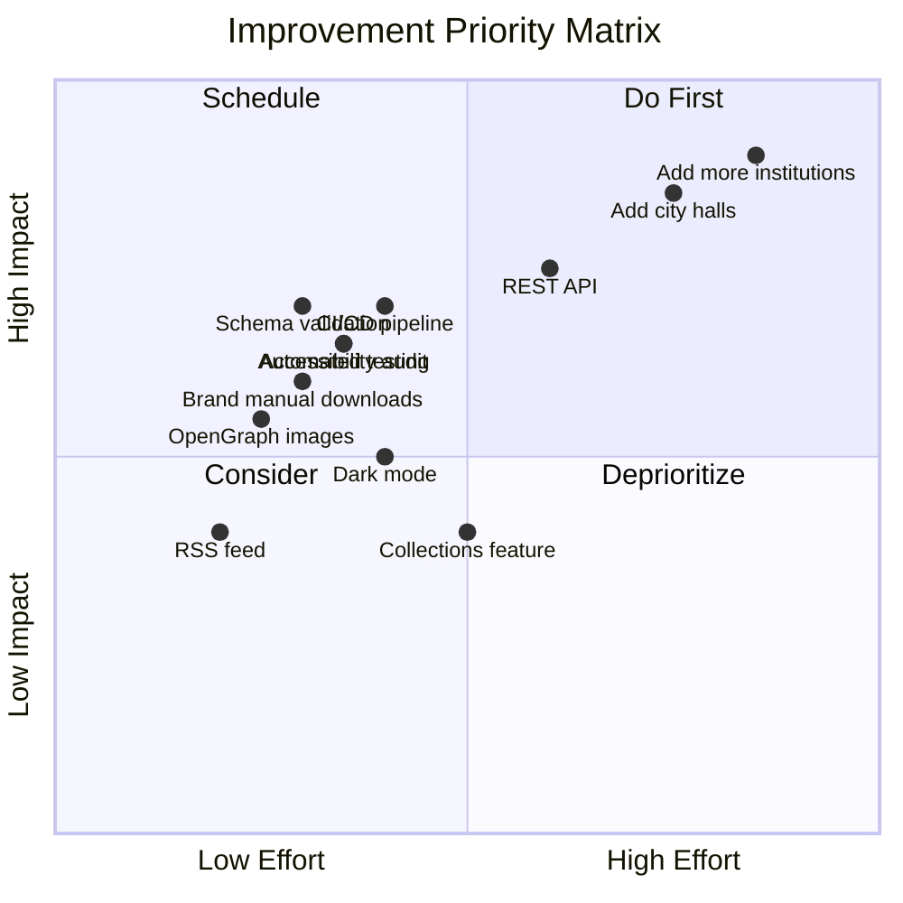

# IdentitateRO - Comprehensive Improvement Roadmap

## Project Status Summary

| Metric | Current Value |
|--------|---------------|
| Total Institutions | 37 |
| Categories Covered | 7 |
| Ministries | 16 |
| Agencies | 8 |
| Authorities | 4 |
| EU Projects | 2 |
| City Halls | 0 |
| County Councils | 1 |
| SVG Coverage | 100% |
| Brand Manuals | 0 |

---

## Priority Matrix



---

## Phase 1: Content Expansion (High Impact)

### 1.1 Add City Halls (Primării)
**Priority: High** | **Impact: Very High**

Romania has 317 city halls. Current coverage: 0.

**Recommended approach:**
1. Start with county capitals (municipii reședință de judțet):
   - București (PMB)
   - Cluj-Napoca ✓ (already exists)
   - Timișoara
   - Iași
   - Constanța
   - Craiova
   - Brașov
   - Galați
   - Ploiești
   - Oradea
   - Bacău
   - Arad
   - Pitești
   - Sibiu
   - Târgu Mureș
   - Baia Mare
   - Satu Mare
   - Drobeta-Turnu Severin
   - Râmnicu Vâlcea
   - Suceava
   - Piatra Neamț

2. Prioritize by population/importance
3. Create standardized metadata for each

### 1.2 Add County Councils (Consilii Județene)
**Priority: High** | **Impact: High**

Current coverage: 1 (Consiliul Județean Timiș)

**Add:**
- All 41 county councils
- CJ București (if applicable)

### 1.3 Add Prefecturi
**Priority: Medium** | **Impact: Medium**

Current coverage: 0

**Add:**
- Prefectura București
- All 41 prefecturi county-level

### 1.4 Complete Ministry Coverage
**Priority: High** | **Impact: High**

Current: 16 ministries (should be ~18-20)

**Missing ministries:**
- Ministerul Sportului (newly created)
- Ministerul Turismului (if exists)
- Other specialized ministries

---

## Phase 2: Technical Improvements

### 2.1 Automated Testing Framework
**Priority: High** | **Impact: High**

**Current state:** No tests

**Recommendations:**
```bash
# Install testing dependencies
npm install --save-dev vitest @testing-library/astro jsdom

# Test categories needed:
- Unit tests for helper functions
- Component rendering tests
- Integration tests for CDN fallback
- Schema validation tests
```

**Files to test:**
- `src/lib/helpers.ts` - all utility functions
- `src/lib/cdn-helpers.ts` - CDN resolution logic
- Component rendering - LogoCard, ColorSwatch

### 2.2 CI/CD Pipeline
**Priority: High** | **Impact: High**

**Recommendations:**
```yaml
# .github/workflows/ci.yml
name: CI/CD Pipeline

on:
  push:
    branches: [main]
  pull_request:
    branches: [main]

jobs:
  test:
    runs-on: ubuntu-latest
    steps:
      - uses: actions/checkout@v4
      - uses: actions/setup-node@v4
        with:
          node-version: '20'
      - run: npm ci
      - run: npm run test
      - run: npm run check

  build:
    needs: test
    runs-on: ubuntu-latest
    steps:
      - run: npm run build
      - run: npm run preview

  deploy:
    needs: build
    if: github.ref == 'refs/heads/main'
    uses: amondnet/vercel-action@v25
    with:
      vercel-token: ${{ secrets.VERCEL_TOKEN }}
      vercel-org-id: ${{ secrets.VERCEL_ORG_ID }}
      vercel-project-id: ${{ secrets.VERCEL_PROJECT_ID }}
```

### 2.3 Schema Validation
**Priority: Medium** | **Impact: High**

**Current:** Basic type guards in `institution.ts`

**Recommendations:**
1. Add JSON Schema validation
2. Add pre-commit hook to validate all JSON files
3. Create `scripts/validate-schema.js`:

```javascript
// Validate all institution JSON files
const Ajv = require('ajv');
const schema = require('./institution.schema.json');
const fs = require('fs');
const path = require('path');

const ajv = new Ajv({ allErrors: true });
const validate = ajv.compile(schema);

const institutionsDir = './src/data/institutions';
const files = fs.readdirSync(institutionsDir);

let errors = [];
files.forEach(file => {
  if (!file.endsWith('.json')) return;
  const data = JSON.parse(fs.readFileSync(path.join(institutionsDir, file)));
  const valid = validate(data);
  if (!valid) {
    errors.push({ file, errors: validate.errors });
  }
});
```

### 2.4 Accessibility Audit
**Priority: Medium** | **Impact: Medium**

**Tools to use:**
- axe-core for automated testing
- WAVE (browser extension) for manual testing
- Lighthouse audit

**Key areas to audit:**
- Color contrast ratios
- Keyboard navigation
- Screen reader compatibility
- Focus indicators
- ARIA labels on interactive elements

### 2.5 Performance Monitoring
**Priority: Low** | **Impact: Medium**

**Recommendations:**
- Add Vercel Analytics (already installed)
- Add Core Web Vitals tracking
- Monitor CDN response times

---

## Phase 3: New Features

### 3.1 Brand Manual Downloads
**Priority: Medium** | **Impact: High**

**Current:** 0 institutions have brand manual URLs

**Implementation:**
1. Add `branding_manual` field to each institution JSON
2. Create download button component:
```astro
---
// DownloadButton.astro
interface Props {
  url: string;
  label: string;
}
const { url, label } = Astro.props;
---
<a href={url} download class="btn-download">
  <Icon name="download" />
  {label}
</a>
```

3. Display on institution detail page

### 3.2 Automated Submission Workflow
**Priority: Medium** | **Impact: High**

**Current:** Manual submission via `solicita.astro`

**Recommendations:**
1. Create GitHub Issues template for submissions
2. Add form validation
3. Create automation to generate JSON from form:
```
User submits form → GitHub Issue created → 
Maintainer reviews → Auto-generates JSON → PR created
```

### 3.3 REST API Endpoint
**Priority: Medium** | **Impact: High**

**Implementation:**
```typescript
// src/pages/api/institutions.json.ts
import type { APIRoute } from 'astro';
import institutions from '../data/institutions-index.json';

export const GET: APIRoute = async () => {
  return new Response(JSON.stringify(institutions), {
    headers: {
      'Content-Type': 'application/json',
      'Cache-Control': 'public, max-age=3600'
    }
  });
};
```

**Endpoints to create:**
- `GET /api/institutions` - all institutions
- `GET /api/institutions/[id]` - single institution
- `GET /api/categories` - category list
- `GET /api/search?q=query` - search

### 3.4 RSS/Atom Feed
**Priority: Low** | **Impact: Medium**

**Implementation:**
```typescript
// src/pages/feed.xml.ts
import rss from '@astrojs/rss';
import { getCollection } from 'astro:content';

export async function GET(context) {
  const institutions = await getCollection('institutions');
  
  return rss({
    title: 'IdentitateRO - Noutăți',
    description: 'Actualizări ale identităților vizuale ale instituțiilor publice',
    site: context.site,
    items: institutions.map(inst => ({
      title: inst.data.name,
      pubDate: new Date(inst.data.meta.last_updated),
      link: `/institution/${inst.slug}/`,
    })),
  });
}
```

### 3.5 Dark Mode Toggle
**Priority: Low** | **Impact: Low**

**Current:** Tailwind has dark mode config but not enabled

**Implementation:**
1. Enable dark mode in `tailwind.config.mjs`
2. Add toggle in Header component
3. Persist preference in localStorage

### 3.6 User Collections/Favorites
**Priority: Low** | **Impact: Low**

**Implementation:**
- Use localStorage for anonymous users
- Optional: Add authentication later for saved collections
- Allow users to "star" institutions
- Create shareable collection URLs

---

## Phase 4: SEO Improvements

### 4.1 OpenGraph Meta Images
**Priority: Medium** | **Impact: Medium**

**Current:** Not implemented

**Implementation:**
1. Create OG image template (1080x1080)
2. Generate dynamic images for each institution
3. Add meta tags in BaseLayout:
```html
<meta property="og:image" content="https://identitate.eu/og/institution-name.png" />
<meta property="og:image:width" content="1080" />
<meta property="og:image:height" content="1080" />
```

### 4.2 Schema.org Structured Data
**Priority: Medium** | **Impact: Medium**

**Implementation:**
```typescript
// Add to institution/[id].astro
const schema = {
  "@context": "https://schema.org",
  "@type": "Organization",
  "name": institution.name,
  "url": institution.resources?.website,
  "logo": institution.assets?.main?.color,
  "image": institution.assets?.main?.color,
};
---
<script type="application/ld+json" set:html={JSON.stringify(schema)} />
```

### 4.3 Sitemap Improvements
**Priority: Low** | **Impact: Medium**

**Current:** Basic sitemap via @astrojs/sitemap

**Enhancements:**
- Add changefreq and priority to pages
- Add lastmod based on institution update date
- Generate separate sitemaps for institutions vs pages

---

## Phase 5: Developer Experience

### 5.1 Comprehensive API Documentation
**Priority: Medium** | **Impact: Medium**

**Create:**
- `docs/api.md` - REST API documentation
- Interactive API explorer on website
- Code examples in multiple languages

### 5.2 Contribution Templates
**Priority: Low** | **Impact: Low**

**Create:**
- `.github/ISSUE_TEMPLATE/institution-request.md`
- `.github/ISSUE_TEMPLATE/bug-report.md`
- `.github/PULL_REQUEST_TEMPLATE.md`

### 5.3 CDN Fallback Tests
**Priority: Medium** | **Impact: Medium**

**Implement integration tests:**
```typescript
// test/cdn-fallback.test.ts
import { describe, it, expect } from 'vitest';

describe('CDN Fallback Chain', () => {
  it('should resolve jsDelivr URL first', async () => {
    const result = resolveAssetPath(asset);
    expect(result).toContain('cdn.jsdelivr.net');
  });
  
  it('should fallback to unpkg on failure', async () => {
    // Mock jsDelivr failure
    const result = resolveAssetPath(asset);
    expect(result).toContain('unpkg.com');
  });
  
  it('should fallback to local on all CDN failure', async () => {
    // Mock all CDN failures
    const result = resolveAssetPath(asset);
    expect(result).toStartWith('/logos/');
  });
});
```

---

## Recommended Priority Order

### Immediate (This Month)
1. **Add city halls** - High impact, builds momentum
2. **Schema validation** - Prevents bad data
3. **CI/CD pipeline** - Improves quality

### Short-term (Next 2-3 Months)
4. **Accessibility audit** - Legal requirement
5. **Brand manual downloads** - High user value
6. **OpenGraph images** - SEO impact
7. **Testing framework** - Technical debt

### Medium-term (6 Months)
8. **REST API** - Developer adoption
9. **RSS feed** - Content syndication
10. **County councils + Prefecturi** - Complete coverage

### Long-term
11. Dark mode
12. User collections
13. Advanced search features

---

## Dependencies & Resources

### NPM Packages Needed
```json
{
  "devDependencies": {
    "vitest": "^2.0.0",
    "@testing-library/astro": "^0.4.0",
    "jsdom": "^24.0.0",
    "ajv": "^8.17.0",
    "@astrojs/rss": "^4.0.0"
  }
}
```

### External Tools
- Lighthouse (browser dev tools)
- axe-core (accessibility)
- WAVE (accessibility)
- Google PageSpeed Insights

---

## Success Metrics

| Goal | Current | Target | Timeline |
|------|---------|--------|----------|
| Institutions | 37 | 100+ | 6 months |
| City hall coverage | 0 | 20 | 3 months |
| Brand manuals | 0 | 10 | 6 months |
| Test coverage | 0% | 70% | 3 months |
| Lighthouse score | TBD | 90+ | 3 months |
| Accessibility | TBD | WCAG AA | 3 months |

---

*Last updated: 2026-02-19*
